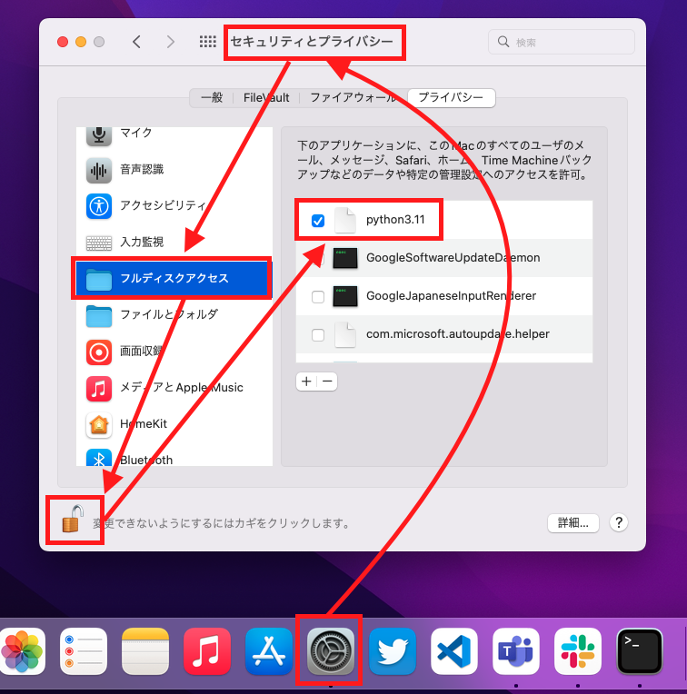

# TCT_AutoAuthentication
某高専のネットワーク自動認証です.

- auto_auth.py: 主にこいつで処理<br>
- auto_auth.[xml|plist]: プログラムの自動起動<br>
- パスワード変わったら再インストールする

<br>

## Requirement
Python3が入ってれば多分動きます.

メインファイルの `auto_auth.py` は, 標準ライブラリのみで記述してあります.

<br>

## Install & Usage

ターミナルを開いて ↓ を実行.

<br>

```bash
# くろ～ん
> git clone git@github.com:physics11688/TCT_AutoAuthentication.git

# ↑が出来ない人は ssh とかを調べるとして, ↓ で入る
> git clone https://github.com/physics11688/TCT_AutoAuthentication.git

# 移動
> cd TCT_AutoAuthentication

# セットアップ (Windows)
> python setup.py

# セットアップ (UNIX系)
$ python3 setup.py

```

<br>

## Uninstall
```bash
# Windows
> python uninstall.py

# UNIX系
$ python3 uninstall.py
```

<br>

#### Macのみ
~~Macのみ追加で設定が必要です.~~

~~Pythonにフルディスクアクセスの権限が必要です.~~

~~使用してる最新のPythonにアクセス権を与えましょう.~~

必要なかった.

<br>



<br>


<br>

## Auto Start Settings
### Windows

`setup.py` では ↓ を実行してます.
XMLファイルのインポートです.

```powershell
> schtasks.exe /Create /TN TCT_AutoAuth /XML \win\auto_auth.xml 
```


<br>

### Linux

NetworkManagerさえ入っていたら, `setup.py` で起動スクリプトを設置してます. 

"connectivity-change events" のみ[チェックしてます](https://man.archlinux.org/man/NetworkManager-dispatcher.8.en).

```bash
$ cat /etc/NetworkManager/dispatcher.d/auto_auth
```


<br>

### Mac

`setup.py` で launchd用の起動スクリプトを設置してます. 

```bash
# plist
% cat /Library/LaunchDaemons/auto_auth.plist
```