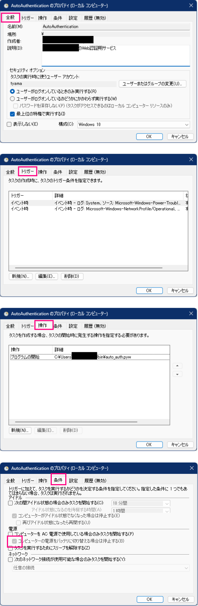

# TCT_AutoAuthentication
某高専のネットワーク自動認証です.

- auto_auth.py: こいつで処理
- auto_auth: Linuxユーザーのみ使用
- パスワード変わったら再インストールする

<br>

## Requiremen
Python3が入ってれば多分動きます.

auto_auth.py は標準ライブラリのみで記述してあります.

<br>

## Install & Usage

ターミナルを開いて ↓ を実行.

<br>

```bash
# くろ～ん
> git clone git@github.com:physics11688/TCT_AutoAuthentication.git

# 移動
> cd TCT_AutoAuthentication

# セットアップ (Windows)
> python setup.py

# セットアップ (UNIX系)
$ python3 setup.py
```

<br>

## auto start settings
### Windows

- [タスクスケジューラ](https://jm1xtk.com/cnt/109_task/index.php)を起動して ↓ の2つを設定
- 操作はもちろん【プログラムの開始】

<br>

|     用途     |   スリープ復帰時用   |             ネットワーク参加時用             |
| :----------: | :------------------: | :------------------------------------------: |
| タスクの開始 |      イベント時      |                  イベント時                  |
|     ログ     |       システム       | Microsoft-Windows-NetworkProfile/Operational |
|    ソース    | Power-Troubleshooter |                NetworkProfile                |
|  イベントID  |          1           |                    10000                     |

<br>



<br>

### Linux
NetworkManagerが入ってれば `setup.py` でやっちゃいます.

具体的には [NetworkManager-dispatcher](https://man.archlinux.org/man/NetworkManager-dispatcher.8.en) からスクリプトで `auto_auth.py` を起動します.

`connectivity-change` はもちろん起動時にも効きます.
(ネットワーク参加時に効くから)


<br>

### Mac

まあそのうち・・・
