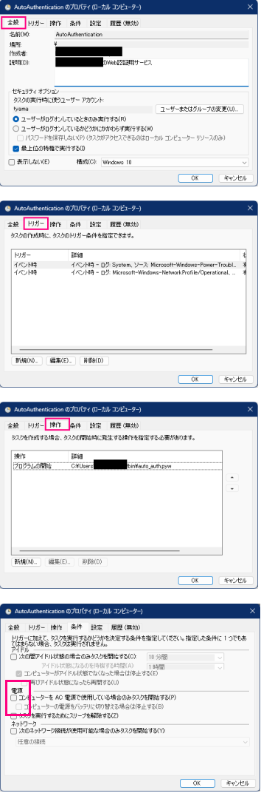

## auto start settings
[タスクスケジューラ](https://jm1xtk.com/cnt/109_task/index.php)を使用してます.

- ログの監視を行って
- イベントが起きたときに
- `auto_auth.py` を起動

してます.

```powershell
# タスクの詳細確認
> Get-ScheduledTaskInfo TCT_AutoAuth

# タスクスケジューラのログ有効化 (管理者としてターミナルを開くこと)
> $log = Get-WinEvent -ListLog Microsoft-Windows-TaskScheduler/Operational

> $log.IsEnabled = $true

> $log.SaveChanges()


# 以降, ログがふつーに見れる (長えから関数かエイリアス・・・)
> Get-WinEvent -Logname Microsoft-Windows-TaskScheduler/Operational | Where-Object {$_.Message -Like "*TCT*"} #| Format-List
```

<br>

ちなみに, GUIで設定・確認する場合は ↓ のようになります.

<br>

|     用途     |   スリープ復帰時用   |             ネットワーク参加時用             |
| :----------: | :------------------: | :------------------------------------------: |
| タスクの開始 |      イベント時      |                  イベント時                  |
|     ログ     |       システム       | Microsoft-Windows-NetworkProfile/Operational |
|    ソース    | Power-Troubleshooter |                NetworkProfile                |
|  イベントID  |          1           |                    10000                     |

<br>



<br>